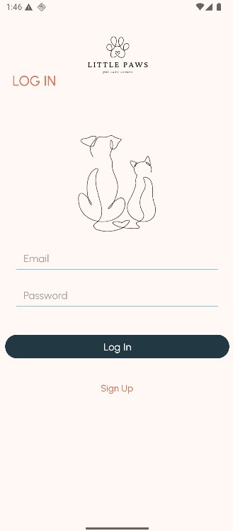
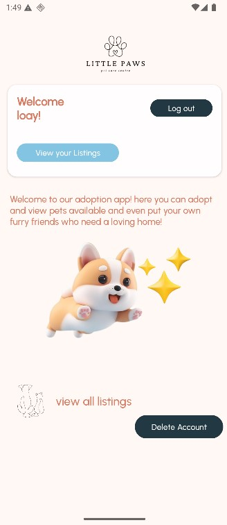

# 📱 Kotlin Firebase App

A simple Android app built using **Kotlin**, **Firebase**, and **ImgBB** for image hosting. The app uses **XML layout** and implements **email/password authentication** and **Cloud Firestore** to store user and app data.

---

## 📑 Table of Contents

1. [Features](#-features)
2. [Installation & Setup](#-installation--setup)
3. [Screenshots](#-Screenshots)

---

## 🚀 Features

- Firebase Email/Password Authentication  
- Cloud Firestore integration  
- ImgBB API for image uploads  
- Clean XML layout UI

---

## 📦 Installation & Setup

### 1. Clone the Repository

```bash
git clone https://github.com/yourusername/your-kotlin-firebase-app.git
```

### 2. Open in Android Studio
Go to File > Project Structure or Sync Project with Gradle Files

Let Android Studio fetch dependencies and sync the project

### 3. Add Your ImgBB API Key
Open the local.properties file and add your API key like this:

IMGBB_API_KEY=YOUR-API-KEY
### 4. Set Up Firebase (Required)
The google-services.json file is not committed to the project.
You will need to set it up yourself.

---

#### Steps:

- Go to Tools > Firebase in Android Studio.

- Connect your app to Firebase.

- Enable Email/Password Authentication in the Firebase Console.

- Enable Cloud Firestore.

✅ Once Firebase is configured and the API key is added, everything should work smoothly.

---

## 🖼️ Screenshots

- **Login Screen**

  

- **Home Screen**

  

- **Listing Screen**

  

  ---

## 🔝 [Back to Top](#-kotlin-firebase-app)

